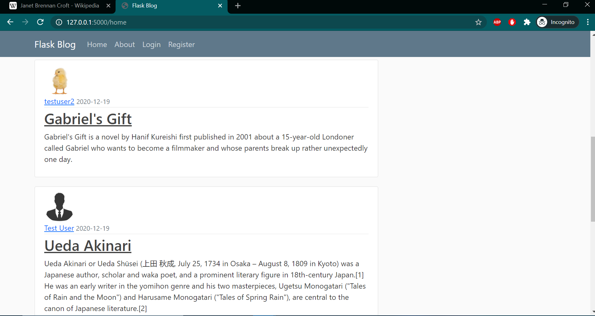

# Flask-server
# Build a blogging website using Flask

Flask is a micro web framework written in Python. It is classified as a microframework because it does not require particular tools or libraries. 
It has no database abstraction layer, form validation, or any other components where pre-existing third-party libraries provide common functions.

# Objective

* To build website where a user can make account, make posts and upload photos as a profile picture.
* To edit or modify posts as weel as delete them also having them in an ordered fashion in a custom profile or account page.
* To have a functionality of sending a password reset request in case a user forgets its password.

# Layouts and Requirements

* Due to the nature of the website, a database handling system is greatly appreciated. This is achieved with the help of SQL Alchemy. In order to work to store data i.e, user email, passwords and also the posts the made by user, SQL Alchemy performs the task with the integeration with python-flask.

* The layout is developed using html and css static codes combined with bootstrap classes to give a appeasing look nad be more user friendly.

FlasK helps in easily making a deployable web app by just executing a single python script but is is impoertant to maintain a heirarchy in structure in order for future updates.

# Pages that are user defined

