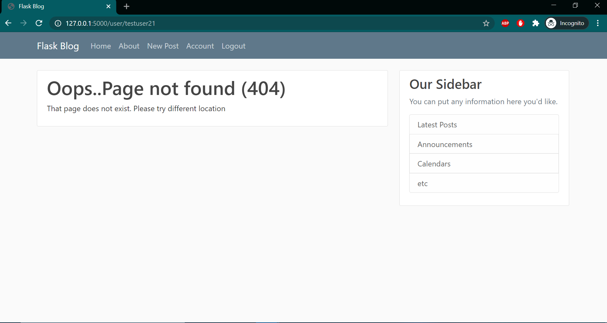
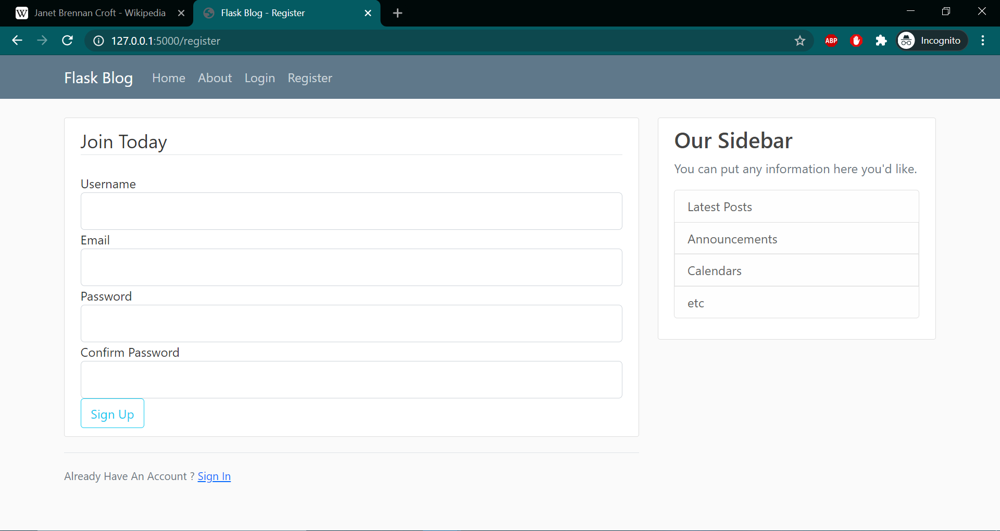
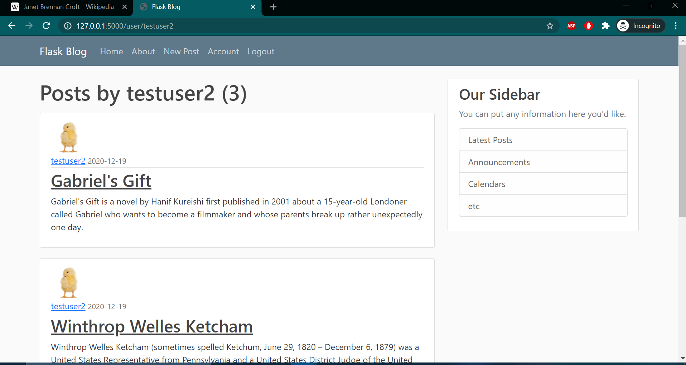
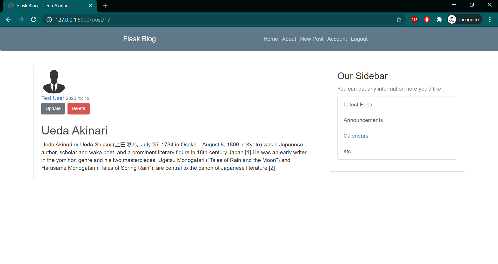
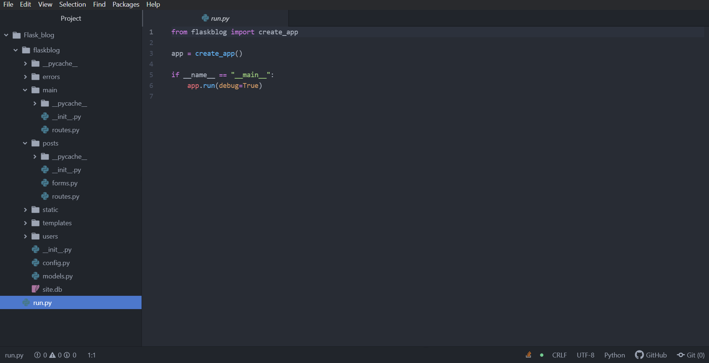

# Flask-server
# Build a blogging website using Flask

Flask is a micro web framework written in Python. It is classified as a microframework because it does not require particular tools or libraries. 
It has no database abstraction layer, form validation, or any other components where pre-existing third-party libraries provide common functions.

# Objective

* To build website where a user can make account, make posts and upload photos as a profile picture.
* To edit or modify posts as well as delete them also having them in an ordered fashion in a custom profile or account page.
* To have a functionality of sending a password reset request in case a user forgets its password.

# Layouts and Requirements

* Due to the nature of the website, a database handling system is greatly appreciated. This is achieved with the help of SQL Alchemy. In order to work to store data i.e, user email, passwords and also the posts the made by user, SQL Alchemy performs the task with the integration with python-flask.

* The layout is developed using html and css static codes combined with bootstrap classes to give a appeasing look and be more user friendly.

FlasK helps in easily making a deployable web app by just executing a single python script but it is important to maintain a hierarchy in structure in order for future updates.

# Custom error handling
Custom error templates are created to handle error such as 404, 403, 500 which extended of our base layout.html file containing the structure of visual layout which is
inherited everywhere.

# Pages that are user defined

It consists of-
* Registration page
* Account page
* New post
* Login and Logout
* Forget password
* Custom error pages

The security feature employed in order to protect a user's account consists of bcrypting the password and matching it when a user try's to log in.
This enables the database to store the hashed passwords instead of the password entered by the user.

Also the blog contains a user's own profile page where they can see the list of posts especially made by them.
Updating of profile picture as well as saving it in database is done but only after reshaping it into a smaller size which done with the help of 'PIL' library of python.

The 'Forget Password' link helps in giving a user the flexibility to gain access to the account even if the password is not remembered by the user.
It sends an email containing Password reset link ('_external')
 
# Employing the usage of Blueprints

The app developed contains various extentions and libraries which help in running the python script in the form if a package. Flask's official documentation promotes the 
usage of bluprints in order to have the same extentions run different application. This allows us to employ the services of Classes in python and take benefit of its
Object Oriented Programming services and the concept of inheritance.

